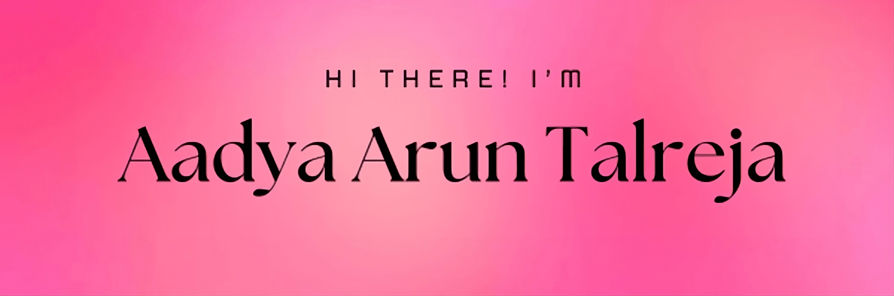

  

## ⚡️ Languages and Tools

<table align="center"> 
 <tr>
  <td>
   <strong>Languages</strong>
  </td>
  <td>
   <strong>Web Development</strong>
  </td>
  <td>
   <strong>Database</strong>
  </td>
 </tr>
 <tr>
  <td>
   
  </td>
  <td>
   
  </td>
  <td>
   
  </td>
 </tr>
 <tr>
  <td>
   <strong>DevOps & Deployment</strong>
  </td>
  <td>
   <strong>Version Control</strong>
  </td>
  <td>
   <strong>Miscellaneous</strong>
  </td>
 </tr>
 <tr>
  <td>
   
  </td>
  <td>
   
  </td>
  <td>
   
  </td>
 </tr>
</table>

## 📊 Stats

  
  
 

